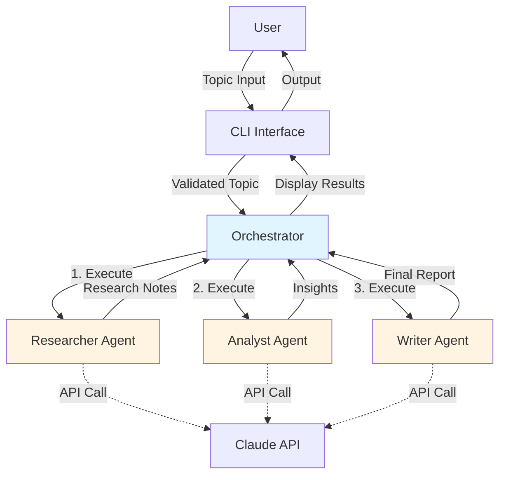
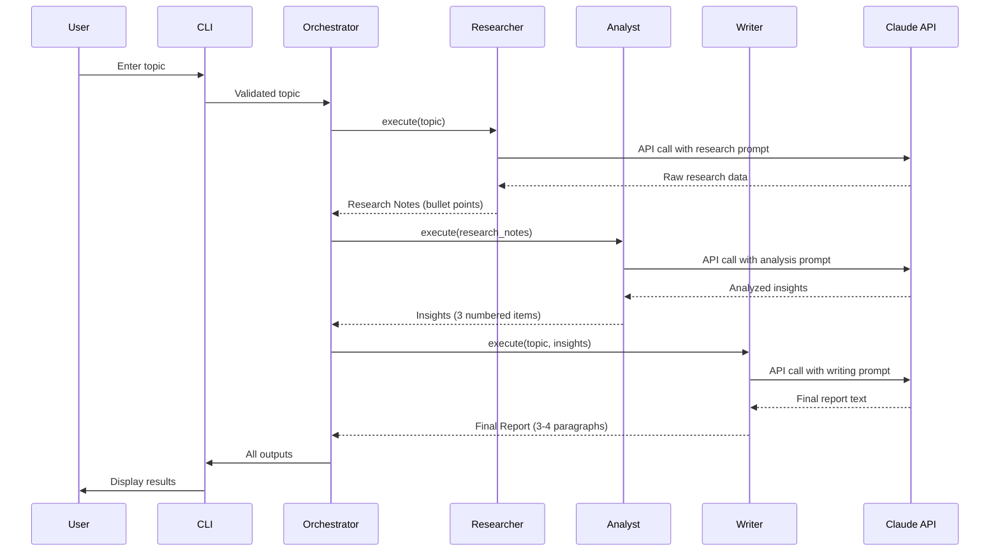

# Design Document: Multi-Agent Research Assistant

## Overview

The Multi-Agent Research Assistant is a Python-based system that demonstrates agent orchestration patterns by coordinating three specialized AI agents (Researcher, Analyst, Writer) in a sequential pipeline. The system takes a user-provided topic, gathers information, analyzes insights, and produces a comprehensive report through automated agent collaboration.

### Key Design Principles

1. **Sequential Pipeline Architecture**: Agents execute in strict order (Researcher → Analyst → Writer) with no branching or parallel execution
2. **Graceful Degradation**: System maintains pipeline continuity through placeholder data when individual agents fail
3. **Clear Separation of Concerns**: Each agent has a single, well-defined responsibility
4. **Stateful Orchestration**: Central orchestrator manages data flow and maintains execution state
5. **CLI-First Development**: Phase 1 focuses on command-line interface for rapid development and testing

### System Boundaries

**In Scope:**
- Sequential orchestration of three AI agents
- Claude API integration via Anthropic SDK
- Command-line interface for user interaction
- In-memory state management
- Error handling with retry logic
- Input validation and output formatting

**Out of Scope (Future Phases):**
- Web-based UI (Streamlit - Phase 2)
- Real-time web search integration (Phase 2)
- Persistent storage (database)
- User authentication
- API rate limiting (beyond SDK defaults)
- Caching mechanisms
- Production deployment infrastructure

## Architecture

### High-Level System Diagram



### Data Flow Sequence



### Architectural Patterns

**Pattern 1: Sequential Pipeline**
- Each agent completes before the next begins
- No concurrent execution in Phase 1
- Output from agent N becomes input to agent N+1

**Pattern 2: Central Orchestrator**
- Single point of control for agent coordination
- Manages state transitions and data passing
- Handles errors and implements retry logic

**Pattern 3: Fail-Safe with Placeholders**
- System continues execution even when agents fail
- Placeholder data substituted for failed outputs
- User receives partial results rather than complete failure

## Components and Interfaces

### 1. Orchestrator (main.py)

**Responsibility**: Coordinates agent execution, manages pipeline state, handles errors

**Public Interface**:
```python
def run_pipeline(topic: str) -> PipelineResult:
    """
    Execute the full agent pipeline for a given topic.
    
    Args:
        topic: User-provided research topic (validated)
    
    Returns:
        PipelineResult containing all outputs and execution status
    
    Raises:
        ValueError: If topic is invalid
        PipelineExecutionError: If critical failure occurs
    """
```

**Internal State**:
- `topic`: str - Validated user input
- `research_notes`: str - Output from Researcher Agent
- `insights`: str - Output from Analyst Agent
- `final_report`: str - Output from Writer Agent
- `execution_status`: dict - Tracks success/failure of each agent

**Key Behaviors**:
1. Validates input topic (length, whitespace)
2. Executes agents in strict sequence
3. Validates agent outputs before proceeding
4. Substitutes placeholders for failed agents
5. Logs all state transitions and errors
6. Returns complete or partial results

### 2. Researcher Agent (agents/researcher.py)

**Responsibility**: Gather factual information about the topic

**Public Interface**:
```python
def execute(topic: str, api_client: APIClient) -> str:
    """
    Generate research notes for the given topic.
    
    Args:
        topic: Research subject
        api_client: Configured Claude API client
    
    Returns:
        Bullet-point list of research findings
    
    Raises:
        AgentExecutionError: If API call fails after retry
    """
```

**System Prompt**:
```
You are a Research Agent. Given a topic, list the key facts, trends, and data points relevant to it. Be factual and concise. Output as a bullet list.
```

**Key Behaviors**:
1. Constructs API request with system prompt and topic
2. Validates response length (≥50 characters)
3. If response too short, retries with enhanced prompt: "List at least 5 distinct points about: {topic}"
4. Returns formatted bullet-point list
5. Implements single retry on API failure

### 3. Analyst Agent (agents/analyst.py)

**Responsibility**: Extract key insights from research notes

**Public Interface**:
```python
def execute(research_notes: str, api_client: APIClient) -> str:
    """
    Analyze research notes and extract 3 key insights.
    
    Args:
        research_notes: Output from Researcher Agent
        api_client: Configured Claude API client
    
    Returns:
        Numbered list of exactly 3 insights
    
    Raises:
        AgentExecutionError: If API call fails after retry
    """
```

**System Prompt**:
```
You are an Analyst Agent. You receive raw research notes. Identify the 3 most important insights, patterns, or implications. Output as a numbered list.
```

**Key Behaviors**:
1. Handles empty/placeholder research notes gracefully
2. Constructs API request with research notes as input
3. Validates output format (numbered list)
4. Returns exactly 3 insights
5. Implements single retry on API failure

### 4. Writer Agent (agents/writer.py)

**Responsibility**: Produce polished report from insights

**Public Interface**:
```python
def execute(topic: str, insights: str, api_client: APIClient) -> str:
    """
    Generate final report from topic and insights.
    
    Args:
        topic: Original research topic
        insights: Output from Analyst Agent
        api_client: Configured Claude API client
    
    Returns:
        Report of 3-4 paragraphs for non-expert readers
    
    Raises:
        AgentExecutionError: If API call fails after retry
    """
```

**System Prompt**:
```
You are a Writer Agent. You receive a topic and key insights. Write a short, clear report (3-4 paragraphs) for a non-expert reader, based ONLY on the given insights.
```

**Key Behaviors**:
1. Accepts both topic and insights as input
2. Handles placeholder insights appropriately (notes "insufficient data")
3. Constructs report grounded only in provided insights
4. Returns 3-4 paragraph report
5. Implements single retry on API failure

### 5. API Client (Anthropic SDK Wrapper)

**Responsibility**: Abstract Claude API interactions with error handling

**Public Interface**:
```python
class APIClient:
    def __init__(self, api_key: str):
        """Initialize client with API key from environment."""
        
    def call_claude(
        self, 
        system_prompt: str, 
        user_message: str,
        max_tokens: int = 1024
    ) -> str:
        """
        Make API call to Claude with retry logic.
        
        Args:
            system_prompt: Agent-specific system prompt
            user_message: User input or agent data
            max_tokens: Maximum response length
        
        Returns:
            Text response from Claude API
        
        Raises:
            AuthenticationError: Invalid API key
            RateLimitError: API rate limit exceeded
            TimeoutError: Request timeout
            NetworkError: Connection failure
        """
```

**Key Behaviors**:
1. Loads API key from `.env` file using `python-dotenv`
2. Initializes Anthropic SDK client
3. Implements timeout handling (SDK default: 60 seconds)
4. Provides clear error messages for different failure modes
5. Extracts text content from API response structure

### 6. CLI Interface (main.py)

**Responsibility**: User interaction and output display

**Key Behaviors**:
1. Prompts user for topic input
2. Displays formatted output sections:
   - **Research Notes**: Bullet-point list
   - **Key Insights**: Numbered list
   - **Final Report**: Paragraphs
3. Shows error messages for validation failures
4. Displays partial results on agent failure
5. Handles KeyboardInterrupt gracefully

## Data Models

### Input Models

**Topic**:
```python
@dataclass
class Topic:
    value: str
    
    def __post_init__(self):
        """Validate topic on creation."""
        self.value = self.value.strip()
        
        if not self.value:
            raise ValueError("Topic cannot be empty")
        
        if len(self.value) > 500:
            raise ValueError("Topic cannot exceed 500 characters")
```

### Output Models

**ResearchNotes**:
```python
@dataclass
class ResearchNotes:
    content: str
    is_placeholder: bool = False
    
    PLACEHOLDER = "Research data unavailable"
    
    @classmethod
    def from_agent_output(cls, output: Optional[str]) -> 'ResearchNotes':
        """Create ResearchNotes from agent output, using placeholder if needed."""
        if not output or len(output) < 50:
            return cls(content=cls.PLACEHOLDER, is_placeholder=True)
        return cls(content=output)
```

**Insights**:
```python
@dataclass
class Insights:
    content: str
    is_placeholder: bool = False
    
    PLACEHOLDER = "Analysis unavailable"
    
    @classmethod
    def from_agent_output(cls, output: Optional[str]) -> 'Insights':
        """Create Insights from agent output, using placeholder if needed."""
        if not output or not cls._is_valid_format(output):
            return cls(content=cls.PLACEHOLDER, is_placeholder=True)
        return cls(content=output)
    
    @staticmethod
    def _is_valid_format(output: str) -> bool:
        """Check if output contains numbered list format."""
        lines = [line.strip() for line in output.split('\n') if line.strip()]
        return any(line[0].isdigit() for line in lines)
```

**FinalReport**:
```python
@dataclass
class FinalReport:
    content: str
    is_placeholder: bool = False
    
    @classmethod
    def from_agent_output(cls, output: Optional[str]) -> 'FinalReport':
        """Create FinalReport from agent output."""
        if not output:
            return cls(
                content="Report generation failed due to insufficient data",
                is_placeholder=True
            )
        return cls(content=output)
```

**PipelineResult**:
```python
@dataclass
class PipelineResult:
    topic: str
    research_notes: ResearchNotes
    insights: Insights
    final_report: FinalReport
    execution_status: Dict[str, bool]  # Maps agent name to success/failure
    errors: List[str]  # Error messages from failed agents
    
    @property
    def is_complete_success(self) -> bool:
        """Check if all agents completed successfully."""
        return all(self.execution_status.values())
    
    @property
    def failed_agents(self) -> List[str]:
        """Get list of agents that failed."""
        return [name for name, success in self.execution_status.items() if not success]
```

### API Models

**ClaudeRequest**:
```python
@dataclass
class ClaudeRequest:
    model: str = "claude-3-5-sonnet-20241022"
    max_tokens: int = 1024
    system: str  # Agent-specific system prompt
    messages: List[Dict[str, str]]  # [{"role": "user", "content": "..."}]
```

**ClaudeResponse**:
```python
@dataclass
class ClaudeResponse:
    id: str
    type: str
    role: str
    content: List[Dict[str, Any]]  # [{"type": "text", "text": "..."}]
    model: str
    stop_reason: str
    
    def extract_text(self) -> str:
        """Extract text content from response."""
        for block in self.content:
            if block.get("type") == "text":
                return block.get("text", "")
        return ""
```

## Correctness Properties

*A property is a characteristic or behavior that should hold true across all valid executions of a system—essentially, a formal statement about what the system should do. Properties serve as the bridge between human-readable specifications and machine-verifiable correctness guarantees.*

### Property 1: Pipeline Sequential Execution and Data Flow

*For any* valid topic, when the pipeline executes, the Orchestrator SHALL execute agents in the exact order Researcher → Analyst → Writer, AND Research_Notes SHALL be passed unmodified to Analyst_Agent, AND both Topic and Insights SHALL be passed unmodified to Writer_Agent.

**Validates: Requirements 1.1, 1.2, 1.3**

### Property 2: Complete Output Display

*For any* pipeline execution that reaches the Writer Agent, the system SHALL display all three outputs (Research_Notes, Insights, Final_Report) in execution order with clear section labels.

**Validates: Requirements 1.5, 8.1, 8.2, 8.3, 8.4, 8.5**

### Property 3: Researcher Output Format

*For any* topic, when Researcher_Agent completes successfully, the Research_Notes SHALL contain at least one line starting with a bullet point character (-, *, or •).

**Validates: Requirements 2.1**

### Property 4: Analyst Output Format

*For any* research notes, when Analyst_Agent completes successfully, the Insights SHALL contain exactly 3 lines that start with a digit followed by a period or parenthesis.

**Validates: Requirements 3.1**

### Property 5: Writer Output Format

*For any* topic and insights, when Writer_Agent completes successfully, the Final_Report SHALL contain 3-4 paragraphs (text blocks separated by double newlines or blank lines).

**Validates: Requirements 4.1**

### Property 6: Placeholder Propagation on Agent Failure

*For any* agent that produces None, empty, or malformed output, the system SHALL substitute appropriate placeholder data and pass it to the next agent, maintaining pipeline continuity without crashing.

**Validates: Requirements 5.4, 11.3**

### Property 7: Partial Success Display

*For any* agent that fails after retry, the system SHALL display all successfully completed outputs from previous agents AND indicate which specific agent failed.

**Validates: Requirements 5.6**

### Property 8: Agent-Specific System Prompt Application

*For any* agent (Researcher, Analyst, or Writer), when making an API call, the system SHALL include that agent's specific system prompt in the request.

**Validates: Requirements 6.3**

### Property 9: Agent Input Data Inclusion

*For any* agent execution, when making an API call, the system SHALL include the appropriate input data (Topic for Researcher, Research_Notes for Analyst, Topic + Insights for Writer) in the API request.

**Validates: Requirements 6.4**

### Property 10: API Response Text Extraction

*For any* successful Claude API response, the system SHALL extract and return the text content from the response structure.

**Validates: Requirements 6.5**

### Property 11: Whitespace-Only Topic Rejection

*For any* topic string consisting only of whitespace characters (spaces, tabs, newlines), the system SHALL reject the input after trimming and display an error message.

**Validates: Requirements 7.2, 7.5**

### Property 12: Valid Topic Acceptance

*For any* topic string that is non-empty after trimming and contains 1-500 characters, the system SHALL accept it and begin pipeline execution.

**Validates: Requirements 7.4**

### Property 13: Topic Whitespace Trimming

*For any* topic string with leading or trailing whitespace, the system SHALL trim the whitespace before processing and use only the trimmed version throughout the pipeline.

**Validates: Requirements 7.5**

### Property 14: Output Section Labeling

*For any* outputs displayed to the user, the system SHALL include distinct labels for each section (Research Notes, Key Insights, Final Report).

**Validates: Requirements 8.4**

### Property 15: Pipeline Execution Triggers from Valid Input

*For any* valid topic entered by the user, the system SHALL execute the full pipeline (all three agents).

**Validates: Requirements 10.2**

### Property 16: Terminal Output Display

*For any* pipeline completion (success or failure), the system SHALL display all available outputs and any error messages to the terminal.

**Validates: Requirements 10.3, 10.4**

### Property 17: State Storage During Execution

*For any* pipeline execution, the Orchestrator SHALL store Topic, Research_Notes, Insights, and Final_Report in memory as each becomes available.

**Validates: Requirements 11.1**

### Property 18: Output Validation Before Proceeding

*For any* agent completion, the Orchestrator SHALL validate that the output is not None before passing it to the next agent.

**Validates: Requirements 11.2**

### Property 19: State Cleanup on Termination

*For any* pipeline execution that completes or fails, the Orchestrator SHALL release all state variables from memory.

**Validates: Requirements 11.5**

### Property 20: Retry Limit Enforcement

*For any* agent API call that fails, the system SHALL attempt exactly 1 retry, and if that retry also fails, SHALL not attempt further retries for that agent.

**Validates: Requirements 12.1, 12.3**

### Property 21: Successful Retry Recovery

*For any* agent that fails on first attempt but succeeds on retry, the system SHALL proceed with the pipeline as if the first call succeeded, using the retry result.

**Validates: Requirements 12.4**

### Property 22: Retry Logging

*For any* retry attempt, the system SHALL log the retry with the reason for retrying (e.g., "Short response", "Network error", "Timeout").

**Validates: Requirements 12.5**

## Error Handling

### Exception Hierarchy

```python
class PipelineError(Exception):
    """Base exception for all pipeline errors."""
    pass

class ValidationError(PipelineError):
    """Raised when input validation fails."""
    pass

class AgentExecutionError(PipelineError):
    """Raised when an agent fails to execute."""
    def __init__(self, agent_name: str, message: str, original_error: Optional[Exception] = None):
        self.agent_name = agent_name
        self.original_error = original_error
        super().__init__(f"{agent_name} failed: {message}")

class APIError(PipelineError):
    """Base exception for API-related errors."""
    pass

class AuthenticationError(APIError):
    """Raised when API key is missing or invalid."""
    pass

class RateLimitError(APIError):
    """Raised when API rate limit is exceeded."""
    pass

class TimeoutError(APIError):
    """Raised when API request times out."""
    pass

class NetworkError(APIError):
    """Raised when network connection fails."""
    pass
```

### Error Handling Strategy by Component

**Orchestrator**:
- Input validation errors → Display clear message, prompt for new input
- Agent execution errors → Log error, use placeholder, continue to next agent
- Critical system errors → Display all completed outputs, indicate failure point

**Agents (Researcher/Analyst/Writer)**:
- API call failures → Retry once with exponential backoff
- Short/malformed responses → Retry with enhanced prompt (Researcher only)
- Failure after retry → Raise `AgentExecutionError` to Orchestrator

**API Client**:
- Authentication errors → Raise immediately (no retry)
- Rate limit errors → Raise immediately with clear message
- Network/timeout errors → Raise after single retry
- Malformed API responses → Raise with response details

### Retry Logic Specification

```python
def call_with_retry(func, max_retries=1, backoff_seconds=2):
    """
    Execute function with retry logic.
    
    Args:
        func: Function to execute
        max_retries: Maximum number of retries (default: 1)
        backoff_seconds: Wait time between retries (default: 2)
    
    Returns:
        Function result
    
    Raises:
        Original exception if all retries fail
    """
    for attempt in range(max_retries + 1):
        try:
            result = func()
            if attempt > 0:
                log_info(f"Retry succeeded on attempt {attempt + 1}")
            return result
        except AuthenticationError:
            # Don't retry auth errors
            raise
        except Exception as e:
            if attempt < max_retries:
                log_warning(f"Attempt {attempt + 1} failed: {e}. Retrying in {backoff_seconds}s...")
                time.sleep(backoff_seconds)
            else:
                log_error(f"All {max_retries + 1} attempts failed")
                raise
```

### Placeholder Data Strategy

| Failure Point | Placeholder Data | Next Agent Behavior |
|---|---|---|
| Researcher fails | "Research data unavailable" | Analyst generates insights noting lack of data |
| Analyst fails | "Analysis unavailable" | Writer produces report noting insufficient analysis |
| Writer fails | "Report generation failed due to insufficient data" | Return to user with partial results |

### Error Message Templates

```python
ERROR_MESSAGES = {
    "empty_topic": "Error: Topic cannot be empty. Please enter a valid research topic.",
    "whitespace_topic": "Error: Topic contains only whitespace. Please enter meaningful text.",
    "topic_too_long": "Error: Topic exceeds 500 characters. Please shorten your topic.",
    "missing_api_key": "Error: ANTHROPIC_API_KEY not found. Please add it to your .env file.",
    "invalid_api_key": "Error: Authentication failed. Please check your API key in .env file.",
    "rate_limit": "Error: API rate limit exceeded. Please wait and try again later.",
    "timeout": "Error: Request timed out. Please check your network connection and try again.",
    "network_error": "Error: Network connection failed. Please check your internet connection.",
    "agent_failed": "Warning: {agent_name} agent failed after retry. Using placeholder data to continue.",
}
```

## Testing Strategy

### Overview

The Multi-Agent Research Assistant will use a comprehensive testing approach combining property-based testing for universal behaviors, unit tests for specific scenarios, and integration tests for end-to-end workflows.

### Property-Based Testing

**Framework**: Hypothesis (Python property-based testing library)

**Test Configuration**:
- Minimum 100 iterations per property test
- Each test tagged with: `# Feature: multi-agent-research-assistant, Property {number}: {property_text}`
- Use `@given` decorators with custom strategies for input generation

**Property Test Coverage**:

Each correctness property (Properties 1-22) will have a corresponding property-based test:

1. **Property 1**: Generate random topics, mock agent outputs, verify execution order and data passing
2. **Property 2**: Generate random outputs, verify all displayed with labels in order
3. **Property 3**: Generate random topics, verify Researcher output contains bullet points
4. **Property 4**: Generate random research notes, verify Analyst output has 3 numbered items
5. **Property 5**: Generate random topics/insights, verify Writer output has 3-4 paragraphs
6. **Property 6**: For each agent, generate None/empty/malformed outputs, verify placeholders
7. **Property 7**: For each agent, mock failure, verify previous outputs displayed with failure indication
8. **Property 8**: For each agent, verify correct system prompt in API request
9. **Property 9**: For each agent, verify correct input data in API request
10. **Property 10**: Generate random API response structures, verify text extraction
11. **Property 11**: Generate whitespace-only strings (spaces, tabs, newlines), verify rejection
12. **Property 12**: Generate valid topics (1-500 chars), verify acceptance
13. **Property 13**: Generate topics with leading/trailing whitespace, verify trimming
14. **Property 14**: Generate any outputs, verify section labels present
15. **Property 15**: Generate valid topics, verify pipeline executes
16. **Property 16**: Generate any completion state, verify terminal output
17. **Property 17**: Generate any topic, verify state storage after each agent
18. **Property 18**: For each agent, verify None check before proceeding
19. **Property 19**: Generate any execution path, verify state cleanup
20. **Property 20**: For each agent, mock failure, count retry attempts (exactly 1)
21. **Property 21**: For each agent, mock failure then success, verify continuation
22. **Property 22**: Trigger various retry reasons, verify all logged

**Custom Hypothesis Strategies**:

```python
from hypothesis import given, strategies as st

# Strategy for valid topics
valid_topics = st.text(
    min_size=1, 
    max_size=500, 
    alphabet=st.characters(blacklist_categories=('Cs',))
).filter(lambda s: s.strip())

# Strategy for whitespace-only strings
whitespace_only = st.text(
    min_size=1,
    alphabet=st.sampled_from([' ', '\t', '\n', '\r'])
)

# Strategy for topics with whitespace padding
padded_topics = st.builds(
    lambda core, left, right: left + core + right,
    core=valid_topics,
    left=st.text(alphabet=st.sampled_from([' ', '\t']), max_size=10),
    right=st.text(alphabet=st.sampled_from([' ', '\t']), max_size=10)
)

# Strategy for bullet-point research notes
research_notes = st.lists(
    st.text(min_size=5, max_size=100),
    min_size=3,
    max_size=10
).map(lambda items: '\n'.join(f"- {item}" for item in items))

# Strategy for numbered insights
insights = st.lists(
    st.text(min_size=10, max_size=150),
    min_size=3,
    max_size=3
).map(lambda items: '\n'.join(f"{i+1}. {item}" for i, item in enumerate(items)))

# Strategy for paragraphs
paragraphs = st.lists(
    st.text(min_size=50, max_size=300),
    min_size=3,
    max_size=4
).map(lambda paras: '\n\n'.join(paras))
```

### Unit Testing

**Framework**: pytest

**Unit Test Focus Areas**:

1. **Input Validation** (Specific examples and edge cases):
   - Empty string rejection
   - Exactly 500 character topic (boundary)
   - Exactly 501 character topic (boundary)
   - Topic with special characters
   - Topic with unicode characters

2. **Retry Logic** (Specific scenarios):
   - Network error triggers retry
   - Timeout triggers retry
   - Short Researcher response triggers enhanced prompt retry
   - Authentication error does NOT trigger retry

3. **Placeholder Handling** (Specific cases):
   - Empty research notes → Analyst uses placeholder
   - Malformed insights → Writer uses placeholder
   - Placeholder propagation maintains pipeline flow

4. **Error Display** (Specific messages):
   - Missing API key error message
   - Invalid API key error message
   - Rate limit error message
   - Specific agent failure indication

5. **Configuration Verification** (One-time checks):
   - Researcher system prompt matches specification
   - Analyst system prompt matches specification
   - Writer system prompt matches specification
   - .env file loaded correctly
   - Dependencies present in requirements.txt

### Integration Testing

**Integration Test Scenarios**:

1. **End-to-End Happy Path**:
   - Valid topic → All agents succeed → Complete output displayed
   - Use mock API responses with realistic content
   - Verify all three outputs present and correctly formatted

2. **Partial Failure Scenarios**:
   - Researcher fails → Placeholder → Analyst/Writer continue
   - Analyst fails → Researcher succeeds → Writer gets placeholder insights
   - Writer fails → Researcher/Analyst outputs displayed

3. **API Integration** (with mocked Anthropic SDK):
   - API call structure verification
   - Response parsing verification
   - Error handling for different API error types

4. **State Management**:
   - State populated correctly after each agent
   - State cleanup after completion
   - State cleanup after failure

### Test Directory Structure

```
tests/
├── unit/
│   ├── test_validation.py
│   ├── test_researcher.py
│   ├── test_analyst.py
│   ├── test_writer.py
│   ├── test_api_client.py
│   └── test_error_handling.py
├── property/
│   ├── test_pipeline_properties.py
│   ├── test_agent_properties.py
│   ├── test_validation_properties.py
│   └── test_retry_properties.py
├── integration/
│   ├── test_end_to_end.py
│   ├── test_partial_failures.py
│   └── test_api_integration.py
└── conftest.py  # Shared fixtures and mock utilities
```

### Mock Strategy

**API Mocking Approach**:

```python
# Mock for successful API responses
class MockClaudeClient:
    def messages_create(self, **kwargs):
        """Mock successful API call."""
        return MockResponse(
            id="msg_123",
            type="message",
            role="assistant",
            content=[{"type": "text", "text": self._generate_response(kwargs)}],
            model="claude-3-5-sonnet-20241022",
            stop_reason="end_turn"
        )
    
    def _generate_response(self, kwargs):
        """Generate appropriate mock response based on system prompt."""
        system_prompt = kwargs.get("system", "")
        if "Research Agent" in system_prompt:
            return "- Fact 1\n- Fact 2\n- Fact 3\n- Fact 4\n- Fact 5"
        elif "Analyst Agent" in system_prompt:
            return "1. Insight one\n2. Insight two\n3. Insight three"
        elif "Writer Agent" in system_prompt:
            return "Paragraph one.\n\nParagraph two.\n\nParagraph three."
        return "Generic response"

# Mock for API failures
class MockFailingClaudeClient:
    def __init__(self, error_type="network", fail_count=1):
        self.error_type = error_type
        self.fail_count = fail_count
        self.call_count = 0
    
    def messages_create(self, **kwargs):
        """Mock API call that fails specified number of times."""
        self.call_count += 1
        if self.call_count <= self.fail_count:
            if self.error_type == "auth":
                raise AuthenticationError("Invalid API key")
            elif self.error_type == "rate_limit":
                raise RateLimitError("Rate limit exceeded")
            elif self.error_type == "timeout":
                raise TimeoutError("Request timed out")
            else:
                raise NetworkError("Connection failed")
        return MockClaudeClient().messages_create(**kwargs)
```

### Test Execution Commands

```bash
# Run all tests
pytest tests/

# Run only property-based tests
pytest tests/property/ -v

# Run only unit tests
pytest tests/unit/ -v

# Run only integration tests
pytest tests/integration/ -v

# Run with coverage report
pytest tests/ --cov=. --cov-report=html

# Run property tests with more iterations (stress test)
pytest tests/property/ --hypothesis-profile=intensive
```

## Project Structure

```
multi-agent-assistant/
├── main.py                      # Entry point with orchestrator logic
├── agents/
│   ├── __init__.py
│   ├── researcher.py            # Researcher agent implementation
│   ├── analyst.py               # Analyst agent implementation
│   └── writer.py                # Writer agent implementation
├── api/
│   ├── __init__.py
│   └── client.py                # Claude API client wrapper
├── models/
│   ├── __init__.py
│   ├── inputs.py                # Input data models (Topic)
│   ├── outputs.py               # Output data models (ResearchNotes, Insights, etc.)
│   └── errors.py                # Custom exception classes
├── utils/
│   ├── __init__.py
│   ├── validation.py            # Input validation functions
│   └── logging.py               # Logging configuration
├── tools/                       # Reserved for Phase 2 (web search)
│   └── __init__.py
├── tests/                       # Test directory (structure shown above)
│   ├── unit/
│   ├── property/
│   ├── integration/
│   └── conftest.py
├── .env                         # API key (not in version control)
├── .env.example                 # Template for .env file
├── .gitignore                   # Excludes .env, __pycache__, etc.
├── requirements.txt             # Python dependencies
├── requirements-dev.txt         # Development dependencies (pytest, hypothesis, etc.)
├── pytest.ini                   # Pytest configuration
├── hypothesis.ini               # Hypothesis profiles
├── README.md                    # Project documentation
└── PROJECT_BLUEPRINT.md         # Architecture and design guidance
```

## Configuration Management

### Environment Variables

**.env File Structure**:
```bash
# Claude API Configuration
ANTHROPIC_API_KEY=sk-ant-xxx...

# Optional: Logging Configuration
LOG_LEVEL=INFO
LOG_FILE=pipeline.log

# Optional: API Configuration
API_TIMEOUT=60
MAX_TOKENS=1024
MODEL_NAME=claude-3-5-sonnet-20241022
```

**.env.example Template**:
```bash
# Copy this file to .env and add your actual API key
ANTHROPIC_API_KEY=your_api_key_here
LOG_LEVEL=INFO
API_TIMEOUT=60
MAX_TOKENS=1024
```

### Configuration Loading

```python
import os
from dotenv import load_dotenv

# Load environment variables
load_dotenv()

# Required configuration
ANTHROPIC_API_KEY = os.getenv("ANTHROPIC_API_KEY")
if not ANTHROPIC_API_KEY:
    raise EnvironmentError(
        "ANTHROPIC_API_KEY not found. Please add it to your .env file."
    )

# Optional configuration with defaults
LOG_LEVEL = os.getenv("LOG_LEVEL", "INFO")
LOG_FILE = os.getenv("LOG_FILE", "pipeline.log")
API_TIMEOUT = int(os.getenv("API_TIMEOUT", "60"))
MAX_TOKENS = int(os.getenv("MAX_TOKENS", "1024"))
MODEL_NAME = os.getenv("MODEL_NAME", "claude-3-5-sonnet-20241022")
```

## Dependencies

### requirements.txt

```
anthropic==0.39.0
python-dotenv==1.0.1
streamlit==1.41.0
```

### requirements-dev.txt

```
pytest==8.3.4
pytest-cov==6.0.0
hypothesis==6.123.3
pytest-mock==3.14.0
black==24.10.0
mypy==1.13.0
ruff==0.8.4
```

### Dependency Rationale

| Dependency | Version | Purpose |
|---|---|---|
| anthropic | 0.39.0 | Official Anthropic SDK for Claude API |
| python-dotenv | 1.0.1 | Load environment variables from .env file |
| streamlit | 1.41.0 | Web UI framework (Phase 2) |
| pytest | 8.3.4 | Test framework |
| pytest-cov | 6.0.0 | Coverage reporting |
| hypothesis | 6.123.3 | Property-based testing framework |
| pytest-mock | 3.14.0 | Mocking utilities for pytest |
| black | 24.10.0 | Code formatter |
| mypy | 1.13.0 | Static type checker |
| ruff | 0.8.4 | Fast Python linter |

## Logging Strategy

### Logging Configuration

```python
import logging
from datetime import datetime

def setup_logging(log_level: str = "INFO", log_file: str = "pipeline.log"):
    """Configure logging for the application."""
    
    # Create formatter
    formatter = logging.Formatter(
        fmt='%(asctime)s - %(name)s - %(levelname)s - %(message)s',
        datefmt='%Y-%m-%d %H:%M:%S'
    )
    
    # Console handler
    console_handler = logging.StreamHandler()
    console_handler.setLevel(log_level)
    console_handler.setFormatter(formatter)
    
    # File handler
    file_handler = logging.FileHandler(log_file)
    file_handler.setLevel(logging.DEBUG)  # Always log DEBUG to file
    file_handler.setFormatter(formatter)
    
    # Root logger
    root_logger = logging.getLogger()
    root_logger.setLevel(logging.DEBUG)
    root_logger.addHandler(console_handler)
    root_logger.addHandler(file_handler)
    
    return root_logger
```

### Logging Levels by Component

| Component | INFO Logs | DEBUG Logs | WARNING Logs | ERROR Logs |
|---|---|---|---|---|
| Orchestrator | Pipeline start/end | State transitions | Placeholder usage | Agent failures |
| Researcher | Agent execution start | API request details | Short response | API errors |
| Analyst | Agent execution start | API request details | Empty input | API errors |
| Writer | Agent execution start | API request details | Placeholder insights | API errors |
| API Client | - | Request/response | Retry attempts | All API errors |

### Log Message Examples

```python
# INFO level
logger.info(f"Starting pipeline for topic: {topic[:50]}...")
logger.info(f"Researcher completed successfully")
logger.info(f"Pipeline completed. Status: {result.is_complete_success}")

# DEBUG level
logger.debug(f"API request: model={model}, max_tokens={max_tokens}")
logger.debug(f"API response received: {len(response)} characters")
logger.debug(f"State after Analyst: insights={insights[:100]}...")

# WARNING level
logger.warning(f"Researcher response too short ({len(response)} chars), retrying with enhanced prompt")
logger.warning(f"Using placeholder for {agent_name} after failure")

# ERROR level
logger.error(f"Researcher failed after retry: {error}", exc_info=True)
logger.error(f"API authentication failed: {error}")
logger.error(f"Pipeline terminated: {error}")
```

## Security Considerations

### API Key Management

1. **Storage**: API keys stored only in `.env` file
2. **Version Control**: `.env` excluded via `.gitignore`
3. **Distribution**: `.env.example` provided as template (no actual keys)
4. **Access**: Read once at startup, stored in memory
5. **Logging**: Never log API keys in any form

### Input Sanitization

1. **Length Limits**: Topic capped at 500 characters
2. **Character Filtering**: No filtering (API handles this)
3. **Injection Prevention**: API calls use structured parameters, not string concatenation
4. **Validation**: All inputs validated before processing

## Performance Considerations

### Expected Latencies

| Operation | Expected Duration | Notes |
|---|---|---|
| Input validation | <10ms | Local processing |
| Researcher API call | 2-5 seconds | Depends on topic complexity |
| Analyst API call | 1-3 seconds | Shorter input than Researcher |
| Writer API call | 2-4 seconds | Similar to Researcher |
| Total pipeline | 5-15 seconds | Sequential execution |

### Optimization Strategies

**Phase 1 (Current)**:
- Sequential execution (simplicity priority)
- Single retry per agent
- No caching
- In-memory state only

**Future Optimizations (Phase 2+)**:
- Parallel execution where possible
- Response caching for repeated topics
- Rate limiting management
- Batch processing for multiple topics

### Resource Usage

**Memory**:
- State storage: ~10-50KB per pipeline execution
- API client: ~5MB
- Total footprint: ~20MB typical

**Network**:
- 3 API calls per execution
- ~1-5KB request size per call
- ~1-10KB response size per call
- Total: ~20-45KB per pipeline

## Future Enhancements (Phase 2 and Beyond)

### Phase 2: Web UI and Real Search

1. **Streamlit Interface**:
   - Text input for topic
   - Three output panels (Research, Analysis, Report)
   - Progress indicators during execution
   - Error display

2. **Web Search Integration**:
   - Real-time data gathering via search API
   - Researcher agent uses search results
   - Citation tracking in research notes

### Phase 3: Persistence and Deployment

1. **Database Integration**:
   - Store historical queries and results
   - Enable query history browsing
   - Cache frequently requested topics

2. **Deployment**:
   - Streamlit Community Cloud hosting
   - Environment variable management
   - Public shareable URL

### Phase 4: Production Features

1. **API Backend** (FastAPI):
   - RESTful endpoints
   - Async execution
   - Webhook notifications

2. **Advanced Features**:
   - User authentication
   - Rate limiting
   - Cost tracking
   - A/B testing different prompts

## Design Decisions and Rationales

### Decision 1: Sequential vs Parallel Execution

**Decision**: Sequential execution in Phase 1

**Rationale**:
- Simpler implementation and debugging
- Clear data dependencies (each agent needs previous output)
- Easier to reason about state
- Performance acceptable for learning project (5-15 seconds)

**Trade-offs**:
- Could parallelize independent operations (e.g., multiple research angles)
- Slightly slower than optimal parallel execution
- Future enhancement opportunity

### Decision 2: In-Memory State vs Database

**Decision**: In-memory state for Phase 1

**Rationale**:
- No infrastructure setup required
- Faster development iteration
- Sufficient for CLI use case
- Aligns with learning objectives

**Trade-offs**:
- No persistence across runs
- Can't review historical queries
- Limited to single user/session

### Decision 3: Single Retry vs Multiple Retries

**Decision**: Exactly 1 retry per agent

**Rationale**:
- Balances resilience with speed
- Avoids excessive API costs
- Handles transient failures
- Keeps execution time bounded

**Trade-offs**:
- May still fail on persistent network issues
- No exponential backoff (could add later)
- Fixed strategy vs adaptive

### Decision 4: Placeholder Data vs Hard Failure

**Decision**: Use placeholder data to continue pipeline

**Rationale**:
- Provides partial results to user
- Demonstrates graceful degradation
- Better user experience
- Shows all working components

**Trade-offs**:
- May produce less useful final output
- User must interpret placeholder data
- Could mask underlying issues

### Decision 5: Anthropic SDK vs Custom HTTP Client

**Decision**: Use official Anthropic SDK

**Rationale**:
- Well-tested and maintained
- Handles authentication automatically
- Built-in retry logic
- Type hints and documentation

**Trade-offs**:
- Additional dependency
- Less control over request details
- SDK updates may require changes

## Acceptance Criteria Mapping

This design addresses all 12 requirements from the requirements document:

- **Requirement 1** (Pipeline Orchestration): Orchestrator component, sequential execution, Property 1
- **Requirement 2** (Researcher Agent): Researcher component, system prompt, retry logic, Properties 3, 20-22
- **Requirement 3** (Analyst Agent): Analyst component, system prompt, error handling, Property 4
- **Requirement 4** (Writer Agent): Writer component, system prompt, placeholder handling, Property 5
- **Requirement 5** (Error Handling): Exception hierarchy, retry logic, placeholder strategy, Properties 6-7, 20-22
- **Requirement 6** (API Integration): API Client component, SDK usage, Properties 8-10
- **Requirement 7** (Input Validation): Topic model, validation rules, Properties 11-13
- **Requirement 8** (Output Display): CLI Interface, formatting, Properties 2, 14, 16
- **Requirement 9** (Project Structure): Directory layout, configuration files
- **Requirement 10** (CLI Interface): CLI component, terminal interaction, Properties 15-16
- **Requirement 11** (State Management): Orchestrator state, validation, cleanup, Properties 17-19
- **Requirement 12** (Retry Logic): Retry implementation, logging, Properties 20-22
