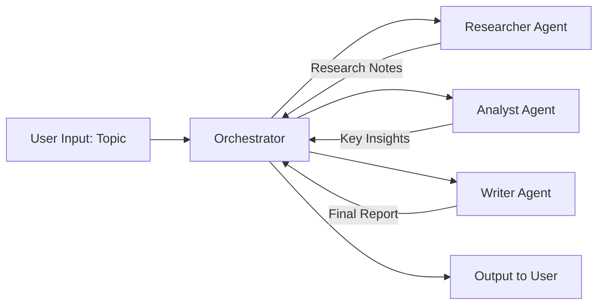

# Multi-Agent Research Assistant — Project Blueprint

A learning + portfolio project: three AI agents collaborate to research a topic, analyze findings, and produce a final report.

---

## 1. Project Overview

**What it does:** You give it a topic. A Researcher agent gathers information, an Analyst agent extracts the key insights, and a Writer agent turns those insights into a clean report.

**Why it matters:** This is a working example of *agent orchestration* — the core skill behind modern "agentic AI" systems. It's small enough to build in 1-2 weeks but demonstrates a real architectural pattern used in production systems.

**Target outcome:** A runnable Python project (script → Streamlit app) you can demo live and explain in interviews.

**Success criteria:**
- Given any topic, the pipeline runs end-to-end without errors
- Each agent's output is visible and makes sense on its own
- The final report is coherent and grounded in the research notes (no contradictions)

---

## 2. System Architecture



**Components:**

| Component | Responsibility | Input | Output |
|---|---|---|---|
| Orchestrator | Runs agents in order, passes data between them | Topic string | Final report |
| Researcher Agent | Gathers raw information on the topic | Topic | Bullet-point research notes |
| Analyst Agent | Extracts the most important insights | Research notes | Numbered list of insights |
| Writer Agent | Produces a polished report for a reader | Topic + insights | 3-4 paragraph report |

---

## 3. Agent Design & Prompts

### Researcher Agent
- **Role:** Information gatherer
- **System prompt:** *"You are a Research Agent. Given a topic, list the key facts, trends, and data points relevant to it. Be factual and concise. Output as a bullet list."*
- **Input:** Topic (string)
- **Output:** Bullet-point notes (string)
- **Failure handling:** If the model returns an empty or very short response, retry once with a more specific prompt asking for "at least 5 distinct points."

### Analyst Agent
- **Role:** Synthesizer
- **System prompt:** *"You are an Analyst Agent. You receive raw research notes. Identify the 3 most important insights, patterns, or implications. Output as a numbered list."*
- **Input:** Research notes (string)
- **Output:** Numbered insights (string)
- **Failure handling:** If input notes are empty (Researcher failed), skip and pass a placeholder ("No data available") so the pipeline doesn't crash.

### Writer Agent
- **Role:** Report writer
- **System prompt:** *"You are a Writer Agent. You receive a topic and key insights. Write a short, clear report (3-4 paragraphs) for a non-expert reader, based ONLY on the given insights."*
- **Input:** Topic + insights (strings)
- **Output:** Final report (string)
- **Failure handling:** If insights are placeholder/empty, writer should note "insufficient data" rather than inventing content.

### Orchestrator
- **Role:** Coordinates the pipeline
- **State management:** Holds topic → notes → insights → report in memory (simple Python variables for now)
- **Routing:** Strictly sequential (Researcher → Analyst → Writer) — no branching needed at this stage
- **Retry logic:** Each agent call gets 1 retry on API error before failing gracefully
- **Timeout handling:** Each API call has a reasonable timeout (handled by the SDK default); on timeout, log and stop pipeline with a clear error message

---

## 4. Data Flow (Step by Step)

1. User enters a topic (via terminal input, later via Streamlit text box)
2. Orchestrator calls `researcher_agent(topic)` → returns research notes
3. Orchestrator calls `analyst_agent(research_notes)` → returns key insights
4. Orchestrator calls `writer_agent(topic, insights)` → returns final report
5. Orchestrator prints/displays all three outputs (notes, insights, report) to the user

---

## 5. Folder Structure

```
multi-agent-assistant/
├── main.py              # Entry point — orchestration logic
├── agents/
│   ├── researcher.py    # researcher_agent() + its system prompt
│   ├── analyst.py        # analyst_agent() + its system prompt
│   └── writer.py          # writer_agent() + its system prompt
├── tools/
│   └── search.py          # (Phase 2) real web search tool for the Researcher
├── .env                    # API key (not committed to git)
├── requirements.txt        # anthropic, streamlit, python-dotenv
├── PROJECT_BLUEPRINT.md     # this file
└── README.md                # how to run, what it does (for recruiters/portfolio)
```

---

## 6. Tech Stack (right-sized)

| Layer | Choice | Why |
|---|---|---|
| Language | Python | Standard for AI/agent work |
| LLM | Claude API (Anthropic SDK) | Simple, well-documented, generous free tier |
| Web search (Phase 2) | A free search API (e.g., Tavily, SerpAPI free tier) | Gives Researcher real live data |
| UI (Phase 2) | Streamlit | Web UI in ~10 lines of Python, no frontend skills needed |
| Deployment (Phase 3) | Streamlit Community Cloud | Free, gives you a shareable link |

> Note: Postgres, Redis, Docker, AWS, Kubernetes, RBAC, CI/CD pipelines — all real and useful at company scale, but unnecessary for a 3-agent portfolio project. These will be covered separately as **concepts you should understand for interviews**, even though we won't build them here.

---

## 7. Roadmap

**Week 1**
- Day 1-2: Get script running locally with API key, test each agent individually
- Day 3-4: Connect agents into full pipeline, test with 3-5 different topics
- Day 5: Add basic error handling (retries, empty-output checks)

**Week 2**
- Day 1-2: Add a real web search tool to the Researcher agent
- Day 3-4: Build Streamlit UI (input box, three output sections)
- Day 5: Write README, deploy to Streamlit Cloud, polish for portfolio

---

## 8. What "Production" Would Add (preview — explained later)

These are the concepts the original enterprise blueprint covers. You don't need them now, but knowing *what they're for* is valuable for interviews:

- **FastAPI backend** — turns this script into a web API other apps can call
- **PostgreSQL** — stores past research queries/reports so users can look them up later
- **Redis** — caches results so repeated queries don't re-run agents (saves cost)
- **Docker** — packages the app so it runs identically anywhere
- **CI/CD (GitHub Actions)** — automatically tests and deploys code on every change
- **AWS (EC2/ECS/RDS)** — where the app actually runs for real users
- **JWT auth + RBAC** — lets multiple users log in securely with different permission levels
- **Monitoring (Prometheus/Grafana)** — tracks if agents are slow, failing, or costing too much

We'll go through each of these as standalone topics once the core project works.
