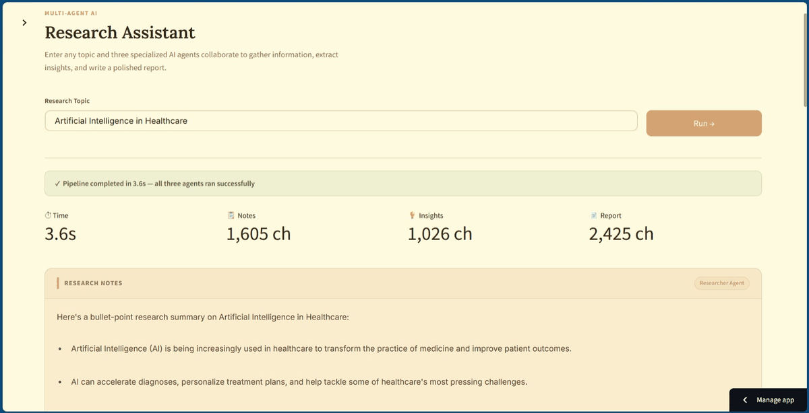

# Multi-Agent Research Assistant

> Three specialized AI agents collaborate to research any topic, extract insights, and produce a polished report — all powered by **Groq (Llama 3.3)** and built with **Streamlit**.

[](https://www.python.org/)
[](https://streamlit.io/)
[](https://groq.com/)
[](tests/)
[](LICENSE)
[](https://multi-agent-research-assistant-jzdud87bjbvedud7zdm2zz.streamlit.app/)

---

## 🚀 Live Demo

**[👉 Try it now → multi-agent-research-assistant.streamlit.app](https://multi-agent-research-assistant-jzdud87bjbvedud7zdm2zz.streamlit.app/)**

---

## Demo



---

## What It Does

You give it a topic. Then three AI agents run in sequence:

| Agent | Role | Output |
|-------|------|--------|
| 🔍 **Researcher** | Gathers facts, trends & live web data | Bullet-point research notes |
| 💡 **Analyst** | Extracts the 3 most important insights | Numbered insight list |
| ✍️ **Writer** | Writes a clean, readable report | 3–4 paragraph report |

All intermediate outputs are displayed so you can see every step of the pipeline.

---

## Architecture

```
User Input (Topic)
      │
      ▼
 Orchestrator
      │
      ├── 1. Researcher Agent ──► (Tavily Web Search) ──► Research Notes
      │
      ├── 2. Analyst Agent ───────────────────────────► Key Insights
      │
      └── 3. Writer Agent ────────────────────────────► Final Report
```

---

## Setup

### Prerequisites
- Python 3.11+
- A free [Groq API key](https://console.groq.com) — sign up free, no credit card needed
- *(Optional)* A free [Tavily API key](https://app.tavily.com) for live web search (1,000 searches/month free)

### Installation

```bash
# 1. Clone the repo
git clone https://github.com/JayRathod07/multi-agent-research-assistant.git
cd multi-agent-research-assistant

# 2. Install dependencies
pip install -r requirements.txt

# 3. Set up your API keys
copy .env.example .env
# Open .env and add your GROQ_API_KEY (and optionally TAVILY_API_KEY)
```

---

## Usage

### 🖥️ Streamlit Web UI (Recommended)

```bash
streamlit run app.py
```

Opens automatically at `http://localhost:8501`

### ⌨️ CLI

```bash
python main.py
```

---

## Project Structure

```
multi-agent-research-assistant/
├── app.py                  # Streamlit Web UI
├── main.py                 # CLI entry point
├── orchestrator.py         # Pipeline coordination
├── api_client.py           # Groq API wrapper
├── retry_logic.py          # Retry utility
├── models.py               # Data models
├── exceptions.py           # Custom exceptions
├── error_messages.py       # Error message templates
├── agents/
│   ├── researcher.py       # Researcher agent (+ web search)
│   ├── analyst.py          # Analyst agent
│   └── writer.py           # Writer agent
├── tools/
│   └── search.py           # Tavily web search tool
├── utils/
│   └── logging_config.py
├── tests/
│   ├── unit/               # 74 unit + integration tests
│   └── integration/
├── docs/
│   └── screenshot_1.png    # App screenshot
├── .streamlit/
│   └── config.toml         # Streamlit theme config
├── .env.example            # Copy → .env and add your keys
├── requirements.txt
└── requirements-dev.txt
```

---

## Running Tests

```bash
# Install dev dependencies
pip install -r requirements-dev.txt

# Run all tests (74 tests)
pytest tests/ -v

# Run with coverage report
pytest tests/ --cov=. --cov-report=html
```

---

## Tech Stack

| Layer | Choice |
|-------|--------|
| Language | Python 3.11+ |
| LLM | Groq — Llama 3.3 70B (free tier) |
| Web Search | Tavily API (free tier) |
| UI | Streamlit |
| Testing | pytest — 74 tests |
| Deployment | Streamlit Community Cloud |

---

## Roadmap

- ✅ **Phase 1** — CLI pipeline with three agents + full test suite
- ✅ **Phase 2** — Streamlit Web UI + real web search via Tavily
- ✅ **Phase 3** — [Live on Streamlit Community Cloud](https://multi-agent-research-assistant-jzdud87bjbvedud7zdm2zz.streamlit.app/)
